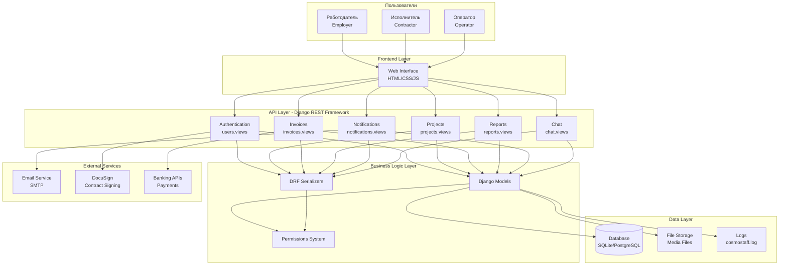
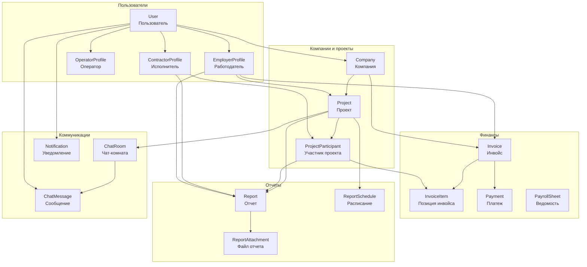
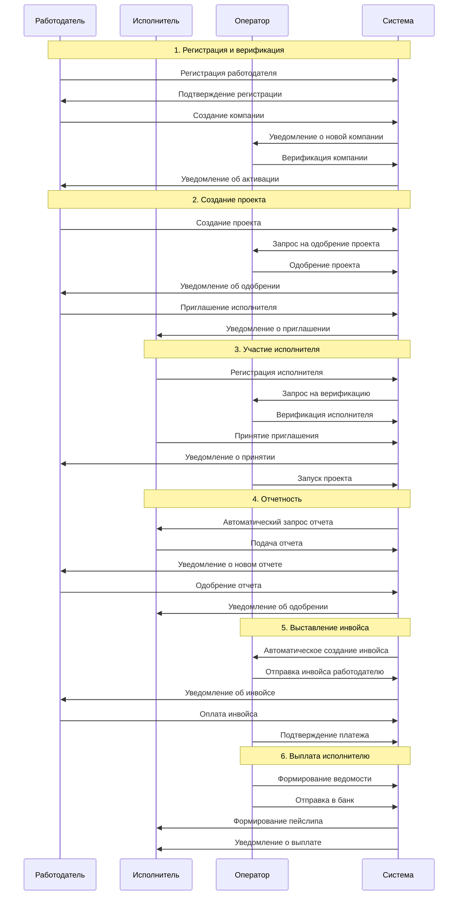

# ТЕХНИЧЕСКАЯ ДОКУМЕНТАЦИЯ
## Информационная система "CosmoStaff EOR Platform"

**Версия документа:** 1.1  
**Статус:** Дополнена подробным описанием моделей и API  

---

## 1. ОБЩИЕ СВЕДЕНИЯ

### 1.1 Наименование системы
Информационная система "CosmoStaff EOR Platform" (далее - Система)

### 1.2 Назначение системы
Система предназначена для автоматизации процессов управления персоналом по модели юридического работодателя (Employer of Record, EOR). Обеспечивает взаимодействие между работодателями, исполнителями и операторами платформы через единый интерфейс.

### 1.3 Область применения
- Компании, нанимающие удаленных сотрудников через третье лицо
- Фрилансеры и удаленные исполнители
- EOR-операторы, предоставляющие услуги юридического работодателя

### 1.4 Полезные ссылки

#### 1.4.1 Основные технологии
- [Django Documentation](https://docs.djangoproject.com/) - официальная документация Django
- [Django REST Framework](https://www.django-rest-framework.org/) - документация DRF
- [Python Official Documentation](https://docs.python.org/3/) - документация Python 3

#### 1.4.2 Используемые библиотеки
- [django-cors-headers](https://github.com/adamchainz/django-cors-headers) - обработка CORS запросов
- [django-filter](https://django-filter.readthedocs.io/) - фильтрация QuerySets
- [Pillow](https://pillow.readthedocs.io/) - работа с изображениями
- [python-decouple](https://github.com/henriquebastos/python-decouple) - управление настройками

#### 1.4.3 Базы данных
- [SQLite Documentation](https://www.sqlite.org/docs.html) - документация SQLite
- [PostgreSQL Documentation](https://www.postgresql.org/docs/) - документация PostgreSQL

#### 1.4.4 Frontend технологии
- [MDN Web Docs](https://developer.mozilla.org/) - документация по HTML, CSS, JavaScript
- [Bootstrap Documentation](https://getbootstrap.com/docs/) - CSS фреймворк
- [Mermaid](https://mermaid.js.org/) - создание диаграмм в Markdown

#### 1.4.5 Внешние сервисы
- [DocuSign API](https://developers.docusign.com/) - API для электронной подписи
- [SMTP Configuration](https://docs.python.org/3/library/smtplib.html) - настройка SMTP для email

---

## 2. АРХИТЕКТУРА СИСТЕМЫ

### 2.1 Общая архитектура
Система построена на основе архитектуры "клиент-сервер" с использованием REST API.

**Компоненты системы:**
- Backend: Django REST Framework
- Frontend: HTML/CSS/JavaScript (SPA)
- База данных: SQLite (разработка), PostgreSQL (продакшн)
- Файловое хранилище: локальная файловая система

### 2.2 Модульная структура
Система состоит из следующих модулей:

1. **Модуль управления пользователями** (`users`)
2. **Модуль управления проектами** (`projects`)
3. **Модуль управления инвойсами и платежами** (`invoices`)
4. **Модуль отчетности** (`reports`)
5. **Модуль уведомлений** (`notifications`)
6. **Модуль чата** (`chat`)

### 2.3 Диаграмма архитектуры системы

Архитектура системы построена по многослойной модели с четким разделением ответственности:



**Компоненты системы:**
- **Слой пользователей** - три типа пользователей с разными уровнями доступа
- **Frontend Layer** - веб-интерфейс на HTML/CSS/JavaScript
- **API Layer** - REST API на Django REST Framework с модульной структурой
- **Business Logic Layer** - модели данных, сериализаторы и система разрешений
- **Data Layer** - база данных, файловое хранилище и логи
- **External Services** - интеграция с внешними сервисами

---

## 3. ТЕХНИЧЕСКОЕ ОПИСАНИЕ

### 3.1 Программное обеспечение
- **Язык программирования:** [Python 3+](https://docs.python.org/3/)
- **Web-фреймворк:** [Django 5.1.0+](https://docs.djangoproject.com/)
- **API фреймворк:** [Django REST Framework 3.15.0+](https://www.django-rest-framework.org/)
- **База данных:** [SQLite](https://www.sqlite.org/docs.html) (разработка), [PostgreSQL](https://www.postgresql.org/docs/) (продакшн)
- **Дополнительные библиотеки:**
  - [django-cors-headers 4.3.1+](https://github.com/adamchainz/django-cors-headers) - обработка CORS
  - [django-filter 23.3+](https://django-filter.readthedocs.io/) - фильтрация данных
  - [Pillow 10.4.0+](https://pillow.readthedocs.io/) - работа с изображениями
  - [python-decouple 3.8+](https://github.com/henriquebastos/python-decouple) - управление конфигурацией

### 3.2 Системные требования
**Минимальные требования сервера:**
- ОС: Linux Ubuntu 18.04+ / Windows 10+ / macOS 10.15+
- RAM: 2 GB
- Дисковое пространство: 10 GB
- Python: 3.8+

**Требования к клиенту:**
- веб-браузер (Chrome 90+, Firefox 88+, Safari 14+)
- JavaScript включен
- Поддержка CORS

### 3.3 Структура базы данных
Система использует реляционную базу данных со следующими основными таблицами:

#### 3.3.1 Таблицы модуля пользователей
- `users_user` - основная таблица пользователей
- `users_company` - компании работодателей
- `users_employerprofile` - профили работодателей
- `users_contractorprofile` - профили исполнителей
- `users_operatorprofile` - профили операторов
- `users_employercontractorrelation` - связи компания-исполнитель

#### 3.3.2 Таблицы модуля проектов
- `projects_project` - проекты
- `projects_projectparticipant` - участники проектов
- `projects_projectchangerequest` - запросы на изменения
- `projects_workpermit` - разрешения на работу

#### 3.3.3 Таблицы модуля инвойсов
- `invoices_invoice` - инвойсы
- `invoices_invoiceitem` - позиции инвойсов
- `invoices_payment` - платежи
- `invoices_payrollsheet` - платежные ведомости
- `invoices_payrollentry` - записи в ведомостях
- `invoices_payslip` - пейслипы

#### 3.3.4 Таблицы модуля отчетов
- `reports_report` - отчеты исполнителей
- `reports_reportattachment` - прикрепления к отчетам
- `reports_reportschedule` - расписания отчетов
- `reports_reporttemplate` - шаблоны отчетов
- `reports_reportcomment` - комментарии к отчетам
- `reports_reportmetrics` - метрики отчетов

#### 3.3.5 Таблицы модуля уведомлений
- `notifications_notification` - уведомления
- `notifications_notificationtemplate` - шаблоны уведомлений
- `notifications_notificationpreference` - настройки уведомлений
- `notifications_emaillog` - логи отправки email

#### 3.3.6 Таблицы модуля чата
- `chat_chatroom` - чат-комнаты
- `chat_chatparticipant` - участники чатов
- `chat_chatmessage` - сообщения
- `chat_chatfile` - файлы в чатах
- `chat_chatmessagereaction` - реакции на сообщения
- `chat_chatsettings` - настройки чатов

---

## 4. ФУНКЦИОНАЛЬНЫЕ ВОЗМОЖНОСТИ

### 4.1 Типы пользователей

#### 4.1.1 Работодатель (Employer)
**Функции:**
- Регистрация и управление компаниями
- Создание и управление проектами
- Приглашение исполнителей
- Просмотр отчетов исполнителей
- Управление инвойсами и платежами
- Участие в чатах проектов

**Ограничения:**
- Доступ только к собственным компаниям и проектам
- Не может верифицировать других пользователей

#### 4.1.2 Исполнитель (Contractor)
**Функции:**
- Регистрация профиля с документами
- Принятие приглашений в проекты
- Подача отчетов по проектам
- Просмотр пейслипов и выплат
- Участие в чатах проектов

**Ограничения:**
- Доступ только к проектам, в которых участвует
- Не может создавать проекты

#### 4.1.3 Оператор (Operator)
**Функции:**
- Верификация пользователей
- Одобрение проектов
- Формирование инвойсов
- Управление платежами
- Активация/деактивация компаний
- Полный доступ к системе

**Ограничения:**
- Административные функции недоступны обычным пользователям

### 4.2 Основные бизнес-процессы

#### 4.2.1 Процесс регистрации работодателя
1. Регистрация пользователя
2. Создание профиля работодателя
3. Создание компании
4. Верификация оператором
5. Подписание договора
6. Активация компании

#### 4.2.2 Процесс регистрации исполнителя
1. Регистрация пользователя (по приглашению)
2. Заполнение профиля и документов
3. Верификация оператором
4. Активация профиля

#### 4.2.3 Процесс создания проекта
1. Создание проекта работодателем
2. Проверка и одобрение оператором
3. Приглашение исполнителей
4. Принятие приглашений
5. Запуск проекта
6. Получение разрешения на работу
7. Фактический старт проекта

#### 4.2.4 Процесс отчетности
1. Автоматическое создание запроса на отчет
2. Уведомление исполнителя
3. Подготовка и подача отчета
4. Рассмотрение работодателем
5. Одобрение или отклонение

#### 4.2.5 Процесс выставления инвойсов
1. Автоматическое формирование инвойса
2. Отправка работодателю
3. Оплата инвойса
4. Регистрация платежа оператором
5. Формирование платежной ведомости
6. Выплата исполнителям
7. Формирование пейслипов

---

## 5. API ИНТЕРФЕЙС

### 5.1 Базовая конфигурация API
- **Базовый URL:** `/api/v1/`
- **Аутентификация:** [Token-based authentication](https://www.django-rest-framework.org/api-guide/authentication/#tokenauthentication)
- **Формат данных:** [JSON](https://www.json.org/)
- **Кодировка:** UTF-8
- **Пагинация:** [PageNumberPagination](https://www.django-rest-framework.org/api-guide/pagination/#pagenumberpagination)
- **Фильтрация:** [DjangoFilterBackend](https://django-filter.readthedocs.io/en/stable/guide/rest_framework.html)

### 5.2 Группы эндпоинтов

#### 5.2.1 Пользователи (`/api/v1/users/`)
```
# Управление пользователями
GET    /api/v1/users/users/                    - Список пользователей
POST   /api/v1/users/users/                    - Создание пользователя
GET    /api/v1/users/users/{id}/               - Детали пользователя
PUT    /api/v1/users/users/{id}/               - Обновление пользователя
DELETE /api/v1/users/users/{id}/               - Удаление пользователя

# Аутентификация
POST   /api/v1/users/users/register/           - Регистрация
POST   /api/v1/users/users/login/              - Авторизация
POST   /api/v1/users/users/logout/             - Выход
GET    /api/v1/users/users/me/                 - Текущий пользователь
GET    /api/v1/users/users/profile/            - Профиль пользователя
PUT    /api/v1/users/users/profile/            - Обновление профиля
POST   /api/v1/users/users/change_password/    - Смена пароля

# Компании
GET    /api/v1/users/companies/               - Список компаний
POST   /api/v1/users/companies/               - Создание компании
GET    /api/v1/users/companies/{id}/          - Детали компании
PUT    /api/v1/users/companies/{id}/          - Обновление компании
DELETE /api/v1/users/companies/{id}/          - Удаление компании
POST   /api/v1/users/companies/{id}/activate/ - Активация компании
POST   /api/v1/users/companies/{id}/deactivate/ - Деактивация компании

# Профили работодателей
GET    /api/v1/users/employers/               - Список работодателей
POST   /api/v1/users/employers/               - Создание профиля
GET    /api/v1/users/employers/{id}/          - Детали профиля
PUT    /api/v1/users/employers/{id}/          - Обновление профиля
POST   /api/v1/users/employers/{id}/verify/   - Верификация работодателя
POST   /api/v1/users/employers/{id}/sign_contract/ - Подписание договора
POST   /api/v1/users/employers/invite_contractor/ - Приглашение исполнителя

# Профили исполнителей
GET    /api/v1/users/contractors/             - Список исполнителей
POST   /api/v1/users/contractors/             - Создание профиля
GET    /api/v1/users/contractors/{id}/        - Детали профиля
PUT    /api/v1/users/contractors/{id}/        - Обновление профиля
POST   /api/v1/users/contractors/{id}/verify/ - Верификация исполнителя

# Профили операторов
GET    /api/v1/users/operators/               - Список операторов
POST   /api/v1/users/operators/               - Создание профиля
GET    /api/v1/users/operators/{id}/          - Детали профиля
PUT    /api/v1/users/operators/{id}/          - Обновление профиля

# Связи компания-исполнитель
GET    /api/v1/users/relations/               - Список связей
POST   /api/v1/users/relations/               - Создание связи
GET    /api/v1/users/relations/{id}/          - Детали связи
PUT    /api/v1/users/relations/{id}/          - Обновление связи
POST   /api/v1/users/relations/{id}/accept/   - Принятие приглашения
POST   /api/v1/users/relations/{id}/reject/   - Отклонение приглашения
POST   /api/v1/users/relations/{id}/terminate/ - Завершение отношений
```

#### 5.2.2 Проекты (`/api/v1/projects/`)
```
# Управление проектами
GET    /api/v1/projects/projects/             - Список проектов
POST   /api/v1/projects/projects/             - Создание проекта
GET    /api/v1/projects/projects/{id}/        - Детали проекта
PUT    /api/v1/projects/projects/{id}/        - Обновление проекта
DELETE /api/v1/projects/projects/{id}/        - Удаление проекта
POST   /api/v1/projects/projects/{id}/approve/ - Одобрение проекта
POST   /api/v1/projects/projects/{id}/start/  - Запуск проекта
GET    /api/v1/projects/projects/statistics/  - Статистика проектов

# Участники проектов
GET    /api/v1/projects/participants/         - Список участников
POST   /api/v1/projects/participants/         - Добавление участника
GET    /api/v1/projects/participants/{id}/    - Детали участника
PUT    /api/v1/projects/participants/{id}/    - Обновление участника
DELETE /api/v1/projects/participants/{id}/    - Удаление участника
POST   /api/v1/projects/participants/{id}/accept_invitation/ - Принятие приглашения

# Запросы на изменения
GET    /api/v1/projects/change-requests/      - Список запросов
POST   /api/v1/projects/change-requests/      - Создание запроса
GET    /api/v1/projects/change-requests/{id}/ - Детали запроса
PUT    /api/v1/projects/change-requests/{id}/ - Обновление запроса
POST   /api/v1/projects/change-requests/{id}/approve/ - Одобрение запроса

# Разрешения на работу
GET    /api/v1/projects/work-permits/         - Список разрешений
POST   /api/v1/projects/work-permits/         - Создание разрешения
GET    /api/v1/projects/work-permits/{id}/    - Детали разрешения
PUT    /api/v1/projects/work-permits/{id}/    - Обновление разрешения
```

#### 5.2.3 Инвойсы (`/api/v1/invoices/`)
```
# Инвойсы
GET    /api/v1/invoices/invoices/             - Список инвойсов
POST   /api/v1/invoices/invoices/             - Создание инвойса
GET    /api/v1/invoices/invoices/{id}/        - Детали инвойса
PUT    /api/v1/invoices/invoices/{id}/        - Обновление инвойса
DELETE /api/v1/invoices/invoices/{id}/        - Удаление инвойса
POST   /api/v1/invoices/invoices/{id}/send/   - Отправка инвойса

# Позиции инвойсов
GET    /api/v1/invoices/invoice-items/        - Список позиций
POST   /api/v1/invoices/invoice-items/        - Создание позиции
GET    /api/v1/invoices/invoice-items/{id}/   - Детали позиции
PUT    /api/v1/invoices/invoice-items/{id}/   - Обновление позиции
DELETE /api/v1/invoices/invoice-items/{id}/   - Удаление позиции

# Платежи
GET    /api/v1/invoices/payments/             - Список платежей
POST   /api/v1/invoices/payments/             - Создание платежа
GET    /api/v1/invoices/payments/{id}/        - Детали платежа
PUT    /api/v1/invoices/payments/{id}/        - Обновление платежа
DELETE /api/v1/invoices/payments/{id}/        - Удаление платежа

# Платежные ведомости
GET    /api/v1/invoices/payroll-sheets/       - Список ведомостей
POST   /api/v1/invoices/payroll-sheets/       - Создание ведомости
GET    /api/v1/invoices/payroll-sheets/{id}/  - Детали ведомости
PUT    /api/v1/invoices/payroll-sheets/{id}/  - Обновление ведомости
DELETE /api/v1/invoices/payroll-sheets/{id}/  - Удаление ведомости

# Записи в ведомостях
GET    /api/v1/invoices/payroll-entries/      - Список записей
POST   /api/v1/invoices/payroll-entries/      - Создание записи
GET    /api/v1/invoices/payroll-entries/{id}/ - Детали записи
PUT    /api/v1/invoices/payroll-entries/{id}/ - Обновление записи
DELETE /api/v1/invoices/payroll-entries/{id}/ - Удаление записи

# Пейслипы
GET    /api/v1/invoices/payslips/             - Список пейслипов
GET    /api/v1/invoices/payslips/{id}/        - Детали пейслипа
```

#### 5.2.4 Отчеты (`/api/v1/reports/`)
```
# Отчеты
GET    /api/v1/reports/reports/               - Список отчетов
POST   /api/v1/reports/reports/               - Создание отчета
GET    /api/v1/reports/reports/{id}/          - Детали отчета
PUT    /api/v1/reports/reports/{id}/          - Обновление отчета
DELETE /api/v1/reports/reports/{id}/          - Удаление отчета
POST   /api/v1/reports/reports/{id}/submit/   - Подача отчета
POST   /api/v1/reports/reports/{id}/approve/  - Одобрение отчета
POST   /api/v1/reports/reports/{id}/reject/   - Отклонение отчета

# Прикрепленные файлы
GET    /api/v1/reports/attachments/           - Список файлов
POST   /api/v1/reports/attachments/           - Загрузка файла
GET    /api/v1/reports/attachments/{id}/      - Детали файла
DELETE /api/v1/reports/attachments/{id}/      - Удаление файла

# Расписания отчетов
GET    /api/v1/reports/schedules/             - Список расписаний
POST   /api/v1/reports/schedules/             - Создание расписания
GET    /api/v1/reports/schedules/{id}/        - Детали расписания
PUT    /api/v1/reports/schedules/{id}/        - Обновление расписания
DELETE /api/v1/reports/schedules/{id}/        - Удаление расписания

# Шаблоны отчетов
GET    /api/v1/reports/templates/             - Список шаблонов
POST   /api/v1/reports/templates/             - Создание шаблона
GET    /api/v1/reports/templates/{id}/        - Детали шаблона
PUT    /api/v1/reports/templates/{id}/        - Обновление шаблона
DELETE /api/v1/reports/templates/{id}/        - Удаление шаблона

# Комментарии к отчетам
GET    /api/v1/reports/comments/              - Список комментариев
POST   /api/v1/reports/comments/              - Создание комментария
GET    /api/v1/reports/comments/{id}/         - Детали комментария
PUT    /api/v1/reports/comments/{id}/         - Обновление комментария
DELETE /api/v1/reports/comments/{id}/         - Удаление комментария

# Метрики отчетов
GET    /api/v1/reports/metrics/               - Список метрик
GET    /api/v1/reports/metrics/{id}/          - Детали метрик
```

#### 5.2.5 Уведомления (`/api/v1/notifications/`)
```
# Уведомления
GET    /api/v1/notifications/notifications/   - Список уведомлений
POST   /api/v1/notifications/notifications/   - Создание уведомления
GET    /api/v1/notifications/notifications/{id}/ - Детали уведомления
PUT    /api/v1/notifications/notifications/{id}/ - Обновление уведомления
DELETE /api/v1/notifications/notifications/{id}/ - Удаление уведомления
POST   /api/v1/notifications/notifications/{id}/mark_read/ - Отметить прочитанным
POST   /api/v1/notifications/notifications/mark_all_read/ - Отметить все прочитанными

# Шаблоны уведомлений
GET    /api/v1/notifications/templates/       - Список шаблонов
POST   /api/v1/notifications/templates/       - Создание шаблона
GET    /api/v1/notifications/templates/{id}/  - Детали шаблона
PUT    /api/v1/notifications/templates/{id}/  - Обновление шаблона
DELETE /api/v1/notifications/templates/{id}/  - Удаление шаблона

# Настройки уведомлений
GET    /api/v1/notifications/preferences/     - Список настроек
POST   /api/v1/notifications/preferences/     - Создание настроек
GET    /api/v1/notifications/preferences/{id}/ - Детали настроек
PUT    /api/v1/notifications/preferences/{id}/ - Обновление настроек
DELETE /api/v1/notifications/preferences/{id}/ - Удаление настроек

# Логи email
GET    /api/v1/notifications/email-logs/      - Список логов
GET    /api/v1/notifications/email-logs/{id}/ - Детали лога
```

#### 5.2.6 Чат (`/api/v1/chat/`)
```
# Чат-комнаты
GET    /api/v1/chat/rooms/                    - Список чат-комнат
POST   /api/v1/chat/rooms/                    - Создание чат-комнаты
GET    /api/v1/chat/rooms/{id}/               - Детали чат-комнаты
PUT    /api/v1/chat/rooms/{id}/               - Обновление чат-комнаты
DELETE /api/v1/chat/rooms/{id}/               - Удаление чат-комнаты

# Сообщения
GET    /api/v1/chat/messages/                 - Список сообщений
POST   /api/v1/chat/messages/                 - Отправка сообщения
GET    /api/v1/chat/messages/{id}/            - Детали сообщения
PUT    /api/v1/chat/messages/{id}/            - Редактирование сообщения
DELETE /api/v1/chat/messages/{id}/            - Удаление сообщения
POST   /api/v1/chat/messages/{id}/react/      - Реакция на сообщение

# Файлы в чате
GET    /api/v1/chat/files/                    - Список файлов
POST   /api/v1/chat/files/                    - Загрузка файла
GET    /api/v1/chat/files/{id}/               - Детали файла
DELETE /api/v1/chat/files/{id}/               - Удаление файла

# Участники чата
GET    /api/v1/chat/participants/             - Список участников
GET    /api/v1/chat/participants/{id}/        - Детали участника
POST   /api/v1/chat/participants/{id}/mark_read/ - Отметить сообщения прочитанными

# Реакции на сообщения
GET    /api/v1/chat/reactions/                - Список реакций
POST   /api/v1/chat/reactions/                - Добавление реакции
DELETE /api/v1/chat/reactions/{id}/           - Удаление реакции

# Настройки чата
GET    /api/v1/chat/settings/                 - Список настроек
POST   /api/v1/chat/settings/                 - Создание настроек
GET    /api/v1/chat/settings/{id}/            - Детали настроек
PUT    /api/v1/chat/settings/{id}/            - Обновление настроек
```

### 5.3 Формат ответов API

#### 5.3.1 Успешные ответы
```json
{
  "id": 1,
  "field1": "value1",
  "field2": "value2",
  "created_at": "01.12.2025 10:30:00",
  "updated_at": "01.12.2025 10:30:00"
}
```

#### 5.3.2 Ошибки
```json
{
  "error": "Описание ошибки",
  "details": {
    "field1": ["Ошибка поля 1"],
    "field2": ["Ошибка поля 2"]
  }
}
```

#### 5.3.3 Пагинация
```json
{
  "count": 100,
  "next": "http://api.example.org/accounts/?page=3",
  "previous": "http://api.example.org/accounts/?page=1",
  "results": [...]
}
```

---

## 6. БЕЗОПАСНОСТЬ

### 6.1 Аутентификация и авторизация
- **Метод аутентификации:** [Token-based authentication](https://www.django-rest-framework.org/api-guide/authentication/#tokenauthentication)
- **Время жизни токена:** Без ограничений (до явного выхода)
- **Хранение токенов:** В заголовке [Authorization](https://developer.mozilla.org/en-US/docs/Web/HTTP/Headers/Authorization)
- **Контроль доступа:** На основе типов пользователей
- **Система разрешений:** [DRF Permissions](https://www.django-rest-framework.org/api-guide/permissions/)

### 6.2 Разрешения пользователей

#### 6.2.1 Иерархия ролей
Система использует трехуровневую иерархию ролей:

1. **Оператор (operator)** - высший уровень доступа
2. **Работодатель (employer)** - средний уровень доступа
3. **Исполнитель (contractor)** - базовый уровень доступа

#### 6.2.2 Разрешения по ролям

##### Работодатель (Employer)
**Доступ к данным:**
- Собственные компании и их данные
- Проекты своих компаний
- Участники проектов своих компаний
- Отчеты по проектам своих компаний
- Инвойсы своих компаний
- Уведомления для себя
- Чаты проектов своих компаний

**Разрешенные действия:**
- Создание и управление компаниями
- Создание и управление проектами
- Приглашение исполнителей в проекты
- Одобрение/отклонение отчетов исполнителей
- Просмотр инвойсов и платежей
- Участие в чатах проектов
- Завершение отношений с исполнителями

**Ограничения:**
- Не может верифицировать пользователей
- Не может одобрять проекты (требуется оператор)
- Не может создавать инвойсы (создаются автоматически)
- Не может активировать/деактивировать компании

##### Исполнитель (Contractor)
**Доступ к данным:**
- Собственный профиль и документы
- Проекты, в которых участвует
- Собственные отчеты
- Собственные пейслипы и выплаты
- Уведомления для себя
- Чаты проектов, в которых участвует
- Разрешения на работу для себя

**Разрешенные действия:**
- Обновление собственного профиля
- Принятие/отклонение приглашений в проекты
- Создание и подача отчетов
- Участие в чатах проектов
- Просмотр собственных выплат

**Ограничения:**
- Не может создавать проекты
- Не может приглашать других исполнителей
- Не может одобрять отчеты
- Не может видеть финансовую информацию компаний
- Не может управлять настройками проектов

##### Оператор (Operator)
**Доступ к данным:**
- Полный доступ ко всем данным системы
- Все пользователи и их профили
- Все компании и проекты
- Все финансовые операции
- Все отчеты и документы
- Системная аналитика

**Разрешенные действия:**
- Верификация пользователей и компаний
- Одобрение/отклонение проектов
- Управление статусами компаний
- Создание и отправка инвойсов
- Обработка платежей
- Формирование платежных ведомостей
- Управление системными настройками
- Модерация чатов

**Особые права:**
- Доступ к административной панели Django
- Управление шаблонами уведомлений
- Просмотр логов системы
- Управление разрешениями на работу

#### 6.2.3 Матрица разрешений

| Действие | Работодатель | Исполнитель | Оператор |
|----------|-------------|-------------|----------|
| Создание компании | ✅ | ❌ | ✅ |
| Активация компании | ❌ | ❌ | ✅ |
| Создание проекта | ✅ | ❌ | ✅ |
| Одобрение проекта | ❌ | ❌ | ✅ |
| Приглашение в проект | ✅ | ❌ | ✅ |
| Принятие приглашения | ❌ | ✅ | ✅ |
| Создание отчета | ❌ | ✅ | ✅ |
| Одобрение отчета | ✅ | ❌ | ✅ |
| Создание инвойса | ❌ | ❌ | ✅ |
| Отправка инвойса | ❌ | ❌ | ✅ |
| Верификация пользователей | ❌ | ❌ | ✅ |
| Просмотр всех данных | ❌ | ❌ | ✅ |

#### 6.2.4 Контроль доступа к данным

##### Фильтрация QuerySet
Каждый ViewSet реализует метод `get_queryset()` для фильтрации данных:

```python
def get_queryset(self):
    user = self.request.user
    if user.user_type == 'employer':
        return self.queryset.filter(employer__user=user)
    elif user.user_type == 'contractor':
        return self.queryset.filter(contractor__user=user)
    elif user.user_type == 'operator':
        return self.queryset.all()
    return self.queryset.none()
```

##### Проверка прав в действиях
Дополнительные действия проверяют права пользователя:

```python
@action(detail=True, methods=['post'])
def approve(self, request, pk=None):
    if request.user.user_type != 'operator':
        return Response({'error': 'Недостаточно прав'}, 
                       status=status.HTTP_403_FORBIDDEN)
    # Логика одобрения
```

#### 6.2.5 Безопасность данных

##### Изоляция по компаниям
- Работодатели видят только данные своих компаний
- Проекты, участники, инвойсы фильтруются по компании
- Исполнители не могут получить доступ к данным других компаний

##### Изоляция по участию
- Исполнители видят только проекты, в которых участвуют
- Отчеты и выплаты фильтруются по участию в проектах
- Чаты доступны только участникам соответствующих проектов

##### Временная изоляция
- Архивные данные остаются доступными для просмотра
- Завершенные проекты сохраняют историю доступа
- Удаленные пользователи теряют доступ к системе

#### 6.2.6 Аудит и логирование

##### Отслеживание действий
- Все критические действия логируются
- Изменения статусов записываются с указанием автора
- Временные метки сохраняются для всех операций

##### Журнал доступа
- Попытки несанкционированного доступа фиксируются
- Токены авторизации привязаны к пользователям
- История входов в систему сохраняется

### 6.3 Защита данных
- **CORS:** Настроен через [django-cors-headers](https://github.com/adamchainz/django-cors-headers) для разрешенных доменов
- **CSRF:** Защита включена через [Django CSRF](https://docs.djangoproject.com/en/stable/ref/csrf/) для веб-интерфейса
- **SQL Injection:** Защита через [Django ORM](https://docs.djangoproject.com/en/stable/topics/db/queries/)
- **XSS:** Автоматическое экранирование через [Django Templates](https://docs.djangoproject.com/en/stable/topics/templates/)

### 6.4 Файловая безопасность
- **Ограничения размера:** 10 МБ на файл
- **Проверка типов:** По MIME-типам
- **Изоляция файлов:** Разделение по пользователям

---

## 7. ПРОИЗВОДИТЕЛЬНОСТЬ И МАСШТАБИРУЕМОСТЬ

### 7.1 Оптимизация запросов
- **Индексы БД:** На часто используемых полях ([Django Database Indexes](https://docs.djangoproject.com/en/stable/ref/models/indexes/))
- **Пагинация:** 20 записей на страницу ([DRF Pagination](https://www.django-rest-framework.org/api-guide/pagination/))
- **Фильтрация:** [django-filter](https://django-filter.readthedocs.io/) для оптимизации запросов
- **Кеширование:** Стандартное [кеширование Django](https://docs.djangoproject.com/en/stable/topics/cache/)

### 7.2 Масштабируемость
- **Горизонтальное масштабирование:** Поддержка через load balancer
- **База данных:** Миграция на [PostgreSQL](https://www.postgresql.org/docs/) для продакшна
- **Файлы:** Возможность использования внешних хранилищ ([Amazon S3](https://docs.aws.amazon.com/s3/), [Google Cloud Storage](https://cloud.google.com/storage/docs))

### 7.3 Мониторинг
- **Логирование:** Файловое логирование в `cosmostaff.log` ([Django Logging](https://docs.djangoproject.com/en/stable/topics/logging/))
- **Уровни логов:** INFO, ERROR, DEBUG ([Python Logging Levels](https://docs.python.org/3/library/logging.html#logging-levels))
- **Метрики:** Встроенные метрики Django

---

## 8. РАЗВЕРТЫВАНИЕ И ЭКСПЛУАТАЦИЯ

### 8.1 Установка системы

#### 8.1.1 Требования к окружению
```bash
# Python 3.8+ (https://docs.python.org/3/)
python --version

# Виртуальное окружение (https://docs.python.org/3/tutorial/venv.html)
python -m venv venv
source venv/bin/activate  # Linux/Mac
venv\Scripts\activate     # Windows
```

#### 8.1.2 Установка зависимостей
```bash
pip install -r requirements.txt
```

#### 8.1.3 Настройка базы данных
```bash
# Django миграции (https://docs.djangoproject.com/en/stable/topics/migrations/)
python manage.py makemigrations
python manage.py migrate
python manage.py createsuperuser
```

#### 8.1.4 Запуск сервера
```bash
python manage.py runserver
```

### 8.2 Конфигурация

#### 8.2.1 Переменные окружения
- `SECRET_KEY` - секретный ключ Django
- `DEBUG` - режим отладки
- `DATABASE_URL` - строка подключения к БД
- `EMAIL_HOST` - SMTP сервер для email

#### 8.2.2 Настройки в settings.py
- `ALLOWED_HOSTS` - разрешенные хосты
- `CORS_ALLOWED_ORIGINS` - разрешенные домены для CORS
- `MEDIA_ROOT` - путь для файлов
- `STATIC_ROOT` - путь для статических файлов

### 8.3 Обслуживание

#### 8.3.1 Резервное копирование
```bash
# Дамп базы данных
python manage.py dumpdata > backup.json

# Восстановление
python manage.py loaddata backup.json
```

#### 8.3.2 Миграции
```bash
# Создание миграций
python manage.py makemigrations

# Применение миграций
python manage.py migrate
```

#### 8.3.3 Сбор статических файлов
```bash
python manage.py collectstatic
```

---

## 9. ТЕСТИРОВАНИЕ

### 9.1 Типы тестов
- **Модульные тесты:** Тестирование отдельных функций
- **Интеграционные тесты:** Тестирование API endpoints
- **Функциональные тесты:** Тестирование бизнес-логики

### 9.2 Запуск тестов
```bash
# Все тесты
python manage.py test

# Тесты конкретного приложения
python manage.py test users

# Конкретный тест
python manage.py test users.tests.UserModelTest
```

### 9.3 Покрытие тестами
Система включает тестовые файлы для каждого приложения:
- `users/tests.py`
- `projects/tests.py`
- `invoices/tests.py`
- `reports/tests.py`
- `notifications/tests.py`
- `chat/tests.py`

---

## 10. ДОКУМЕНТАЦИЯ ДЛЯ РАЗРАБОТЧИКОВ

### 10.1 Структура проекта
```
CosmoStaff/
├── CosmoStaff/          # Основные настройки проекта
├── users/               # Модуль пользователей
├── projects/            # Модуль проектов
├── invoices/            # Модуль инвойсов
├── reports/             # Модуль отчетов
├── notifications/       # Модуль уведомлений
├── chat/                # Модуль чата
├── templates/           # HTML шаблоны
├── static/              # Статические файлы
├── media/               # Загружаемые файлы
├── requirements.txt     # Зависимости Python
└── manage.py           # Управляющий скрипт Django
```

### 10.2 Соглашения по коду
- **Кодировка:** UTF-8
- **Стиль кода:** [PEP 8](https://peps.python.org/pep-0008/) - Style Guide for Python Code
- **Названия переменных:** snake_case
- **Названия классов:** PascalCase
- **Языки:** Русский для пользовательского интерфейса, английский для кода

### 10.3 Модели данных
Все модели наследуют от [`django.db.models.Model`](https://docs.djangoproject.com/en/stable/topics/db/models/) и включают:
- Поля `created_at` и `updated_at` для аудита
- Методы [`__str__()`](https://docs.djangoproject.com/en/stable/ref/models/instances/#str) для читаемого представления
- [Метаданные](https://docs.djangoproject.com/en/stable/topics/db/models/#meta-options) для сортировки и отображения

## 13. ОПИСАНИЕ МОДЕЛЕЙ ДАННЫХ

### 13.1 Модуль пользователей (users)

#### 13.1.1 User (Пользователь)
Расширенная модель пользователя на основе `AbstractUser`.

**Поля:**
- `user_type` - тип пользователя (employer/contractor/operator)
- `phone` - номер телефона
- `is_verified` - статус верификации
- `created_at` - дата создания
- `updated_at` - дата обновления

**Методы:**
- `__str__()` - возвращает username и тип пользователя

#### 13.1.2 Company (Компания)
Модель компании работодателя.

**Поля:**
- `name` - название компании
- `description` - описание компании
- `legal_address` - юридический адрес
- `tax_number` - налоговый номер
- `contact_person` - контактное лицо
- `vat_included` - включать НДС в инвойсы
- `status` - статус (active/inactive/pending)
- `is_contract_signed` - подписан ли договор
- `contract_signed_date` - дата подписания договора
- `owner` - владелец компании (ForeignKey к User)

**Связи:**
- Один ко многим с Project (проекты компании)
- Один ко многим с Invoice (инвойсы компании)
- Один ко многим с EmployerContractorRelation (связи с исполнителями)

#### 13.1.3 EmployerProfile (Профиль работодателя)
Расширенная информация о работодателе.

**Поля:**
- `user` - связь с User (OneToOne)
- `is_contract_signed` - подписан ли договор
- `contract_signed_date` - дата подписания

**Свойства:**
- `companies` - все компании работодателя

#### 13.1.4 ContractorProfile (Профиль исполнителя)
Подробная информация об исполнителе.

**Поля:**
- `user` - связь с User (OneToOne)
- `first_name`, `last_name`, `middle_name` - ФИО
- `birth_date` - дата рождения
- `passport_series`, `passport_number` - паспортные данные
- `passport_issued_by`, `passport_issued_date` - кем и когда выдан паспорт
- `registration_address`, `actual_address` - адреса
- `bank_name`, `bank_account`, `bank_routing`, `bank_swift` - банковские реквизиты
- `passport_scan`, `tax_number_scan` - сканы документов
- `is_verified` - статус верификации
- `verification_date` - дата верификации

**Свойства:**
- `full_name` - полное имя

#### 13.1.5 OperatorProfile (Профиль оператора)
Информация об операторе платформы.

**Поля:**
- `user` - связь с User (OneToOne)
- `department` - отдел
- `position` - должность
- `permissions` - разрешения (JSON)

#### 13.1.6 EmployerContractorRelation (Связь компания-исполнитель)
Связь между компанией и исполнителем.

**Поля:**
- `company` - компания (ForeignKey)
- `contractor` - исполнитель (ForeignKey)
- `status` - статус связи (pending/active/rejected/terminated)
- `invited_at` - дата приглашения
- `accepted_at` - дата принятия
- `terminated_at` - дата завершения

### 13.2 Модуль проектов (projects)

#### 13.2.1 Project (Проект)
Основная модель проекта.

**Поля:**
- `title` - название проекта
- `description` - описание проекта
- `company` - компания (ForeignKey)
- `employer` - работодатель (ForeignKey)
- `start_date`, `end_date` - планируемые даты
- `actual_start_date` - фактическая дата начала
- `is_indefinite` - бессрочный проект
- `status` - статус (draft/pending_approval/approved/active/completed/cancelled)
- `reporting_type` - тип отчетности (none/monthly/on_demand)
- `approved_by` - кем одобрен (ForeignKey к OperatorProfile)
- `approved_at` - дата одобрения

**Свойства:**
- `is_active` - активен ли проект
- `total_monthly_cost` - общая стоимость в месяц

#### 13.2.2 ProjectParticipant (Участник проекта)
Участие исполнителя в проекте.

**Поля:**
- `project` - проект (ForeignKey)
- `contractor` - исполнитель (ForeignKey)
- `position` - должность
- `monthly_salary` - месячная оплата
- `hours_per_day`, `hours_per_week`, `days_per_month` - рабочая нагрузка
- `status` - статус (invited/accepted/declined/active/completed/terminated)
- `invited_at`, `accepted_at`, `started_at`, `completed_at` - временные метки

#### 13.2.3 ProjectChangeRequest (Запрос на изменение)
Запрос на изменение проекта.

**Поля:**
- `project` - проект (ForeignKey)
- `change_type` - тип изменения
- `description` - описание изменений
- `changes_data` - данные изменений (JSON)
- `status` - статус (pending/approved/rejected)
- `processed_by` - кем обработан (ForeignKey к OperatorProfile)
- `rejection_reason` - причина отклонения

#### 13.2.4 WorkPermit (Разрешение на работу)
Разрешение на работу от миграционной службы.

**Поля:**
- `participant` - участник (OneToOne)
- `permit_number` - номер разрешения
- `issued_date`, `expiry_date` - даты выдачи и истечения
- `status` - статус (pending/approved/rejected/expired)

**Свойства:**
- `is_expired` - истекло ли разрешение

### 13.3 Модуль инвойсов (invoices)

#### 13.3.1 Invoice (Инвойс)
Счет для работодателя.

**Поля:**
- `invoice_number` - номер инвойса (уникальный)
- `company`, `employer` - компания и работодатель
- `invoice_type` - тип (onboarding/monthly/termination)
- `currency` - валюта (USD/EUR/USDT)
- `subtotal`, `vat_rate`, `vat_amount`, `total_amount` - финансовые данные
- `status` - статус (draft/sent/paid/overdue/cancelled)
- `issue_date`, `due_date`, `paid_date` - даты
- `period_start`, `period_end` - период для ежемесячных инвойсов
- `payment_details` - платежные реквизиты (JSON)
- `pdf_file` - PDF файл

**Методы:**
- `save()` - автоматический расчет НДС и общей суммы

**Свойства:**
- `is_overdue` - просрочен ли инвойс

#### 13.3.2 InvoiceItem (Позиция инвойса)
Отдельная позиция в инвойсе.

**Поля:**
- `invoice` - инвойс (ForeignKey)
- `description` - описание
- `quantity`, `unit_price`, `amount` - количество, цена, сумма
- `participant` - участник проекта (для ежемесячных платежей)

#### 13.3.3 Payment (Платеж)
Платеж по инвойсу.

**Поля:**
- `invoice` - инвойс (ForeignKey)
- `amount`, `currency` - сумма и валюта
- `payment_date` - дата платежа
- `payment_method` - способ оплаты
- `transaction_id` - ID транзакции
- `status` - статус (pending/confirmed/failed)
- `notes` - примечания

#### 13.3.4 PayrollSheet (Платежная ведомость)
Ведомость для выплат исполнителям.

**Поля:**
- `sheet_number` - номер ведомости (уникальный)
- `period_start`, `period_end` - период
- `total_amount` - общая сумма
- `status` - статус (draft/approved/sent_to_bank/processed)
- `approved_at`, `sent_to_bank_at`, `processed_at` - временные метки

#### 13.3.5 PayrollEntry (Запись в ведомости)
Отдельная запись о выплате исполнителю.

**Поля:**
- `payroll_sheet` - ведомость (ForeignKey)
- `contractor` - исполнитель (ForeignKey)
- `participant` - участие в проекте (ForeignKey)
- `gross_amount` - сумма до вычетов
- `tax_amount` - сумма налогов
- `net_amount` - сумма к выплате
- `days_worked` - отработано дней

#### 13.3.6 Payslip (Пейслип)
Справка о выплате для исполнителя.

**Поля:**
- `contractor` - исполнитель (ForeignKey)
- `payroll_entry` - запись в ведомости (OneToOne)
- `period_start`, `period_end` - период
- `pdf_file` - PDF файл

### 13.4 Модуль отчетов (reports)

#### 13.4.1 Report (Отчет)
Отчет исполнителя о проделанной работе.

**Поля:**
- `project`, `participant`, `contractor`, `employer` - связи
- `report_type` - тип (monthly/on_demand)
- `period_start`, `period_end` - период отчета
- `title` - заголовок
- `description` - описание выполненных работ
- `achievements` - достижения
- `challenges` - проблемы и сложности
- `next_period_plans` - планы на следующий период
- `hours_worked` - отработано часов
- `status` - статус (requested/draft/submitted/accepted/rejected)
- `requested_at`, `due_date`, `submitted_at`, `reviewed_at` - временные метки
- `feedback` - обратная связь от работодателя
- `rejection_reason` - причина отклонения

**Свойства:**
- `is_overdue` - просрочен ли отчет

#### 13.4.2 ReportAttachment (Прикрепленный файл)
Файл, прикрепленный к отчету.

**Поля:**
- `report` - отчет (ForeignKey)
- `file` - файл
- `filename` - имя файла
- `file_size` - размер файла

#### 13.4.3 ReportSchedule (Расписание отчетов)
Настройки расписания отчетов для проекта.

**Поля:**
- `project` - проект (OneToOne)
- `monthly_due_day` - день подачи ежемесячного отчета
- `notification_days_before` - уведомлять за N дней
- `auto_create_monthly` - автоматически создавать ежемесячные отчеты

#### 13.4.4 ReportTemplate (Шаблон отчета)
Шаблон для создания отчетов.

**Поля:**
- `name` - название шаблона
- `description` - описание
- `title_template`, `description_template` - шаблоны полей
- `is_active`, `is_default` - настройки активности

#### 13.4.5 ReportComment (Комментарий к отчету)
Комментарий к отчету.

**Поля:**
- `report` - отчет (ForeignKey)
- `author` - автор комментария (ForeignKey к User)
- `content` - содержание комментария

#### 13.4.6 ReportMetrics (Метрики отчета)
Метрики отчета для аналитики.

**Поля:**
- `report` - отчет (OneToOne)
- `time_to_submit`, `time_to_review` - временные метрики
- `word_count` - количество слов
- `attachment_count` - количество файлов
- `quality_score` - оценка качества

### 13.5 Модуль уведомлений (notifications)

#### 13.5.1 Notification (Уведомление)
Уведомление пользователю.

**Поля:**
- `recipient` - получатель (ForeignKey к User)
- `notification_type` - тип уведомления
- `title`, `message` - заголовок и сообщение
- `priority` - приоритет (low/medium/high/urgent)
- `content_type`, `object_id`, `content_object` - связь с объектом (GenericForeignKey)
- `is_read`, `read_at` - статус прочтения
- `send_email`, `send_push` - настройки доставки
- `email_sent`, `push_sent` - статус отправки
- `action_url` - ссылка для действия
- `extra_data` - дополнительные данные (JSON)

#### 13.5.2 NotificationTemplate (Шаблон уведомления)
Шаблон для создания уведомлений.

**Поля:**
- `notification_type` - тип уведомления (уникальный)
- `title_template`, `message_template` - шаблоны
- `default_priority`, `default_send_email`, `default_send_push` - настройки по умолчанию
- `is_active` - активен ли шаблон

#### 13.5.3 NotificationPreference (Настройки уведомлений)
Персональные настройки уведомлений пользователя.

**Поля:**
- `user` - пользователь (OneToOne)
- `email_notifications`, `push_notifications` - общие настройки
- `preferences` - персональные настройки (JSON)
- `quiet_hours_start`, `quiet_hours_end` - тихие часы

#### 13.5.4 EmailLog (Лог отправки email)
Журнал отправки email уведомлений.

**Поля:**
- `notification` - уведомление (ForeignKey)
- `recipient_email` - email получателя
- `subject`, `body` - тема и тело письма
- `status` - статус (pending/sent/failed/bounced)
- `sent_at` - время отправки
- `error_message` - сообщение об ошибке
- `opened_at`, `clicked_at` - метрики открытия и кликов

### 13.6 Модуль чата (chat)

#### 13.6.1 ChatRoom (Чат-комната)
Чат-комната для проекта.

**Поля:**
- `project` - проект (OneToOne)
- `name` - название чата
- `description` - описание
- `participants` - участники (ManyToMany через ChatParticipant)
- `is_active` - активен ли чат

**Свойства:**
- `last_message` - последнее сообщение

#### 13.6.2 ChatParticipant (Участник чата)
Участник чат-комнаты.

**Поля:**
- `chat_room` - чат-комната (ForeignKey)
- `user` - пользователь (ForeignKey)
- `role` - роль (employer/contractor/admin)
- `can_send_messages`, `can_upload_files` - права участника
- `joined_at` - время присоединения
- `last_read_at` - время последнего прочтения
- `is_active` - активен ли участник

**Свойства:**
- `unread_messages_count` - количество непрочитанных сообщений

#### 13.6.3 ChatMessage (Сообщение в чате)
Сообщение в чат-комнате.

**Поля:**
- `chat_room` - чат-комната (ForeignKey)
- `sender` - отправитель (ForeignKey к User)
- `message_type` - тип сообщения (text/file/image/system)
- `content` - содержание сообщения
- `reply_to` - ответ на сообщение (ForeignKey к себе)
- `is_edited`, `edited_at` - статус редактирования
- `is_deleted`, `deleted_at` - статус удаления

**Методы:**
- `soft_delete()` - мягкое удаление сообщения

#### 13.6.4 ChatFile (Файл в чате)
Файл, прикрепленный к сообщению.

**Поля:**
- `message` - сообщение (ForeignKey)
- `file` - файл
- `original_filename` - оригинальное имя файла
- `file_size` - размер файла
- `mime_type` - MIME тип
- `thumbnail` - превью для изображений

**Свойства:**
- `is_image` - является ли файл изображением
- `file_size_formatted` - форматированный размер файла

#### 13.6.5 ChatMessageReaction (Реакция на сообщение)
Реакция пользователя на сообщение.

**Поля:**
- `message` - сообщение (ForeignKey)
- `user` - пользователь (ForeignKey)
- `reaction` - реакция (эмодзи)

#### 13.6.6 ChatSettings (Настройки чата)
Настройки чат-комнаты.

**Поля:**
- `chat_room` - чат-комната (OneToOne)
- `allow_file_uploads` - разрешить загрузку файлов
- `max_file_size` - максимальный размер файла
- `allowed_file_types` - разрешенные типы файлов (JSON)
- `allow_message_editing`, `allow_message_deletion` - разрешения на редактирование
- `message_retention_days` - дни хранения сообщений
- `notify_on_new_message`, `notify_on_file_upload` - настройки уведомлений

## 14. ОПИСАНИЕ API ПРЕДСТАВЛЕНИЙ (VIEWS)

### 14.1 Модуль пользователей (users.views)

#### 14.1.1 UserViewSet
Основной ViewSet для управления пользователями.

**Базовые операции:** CRUD для пользователей
**Разрешения:** IsAuthenticated (кроме регистрации и авторизации)

**Дополнительные действия:**
- `register` (POST) - регистрация нового пользователя
  - Доступ: AllowAny
  - Создает пользователя и возвращает токен
- `login` (POST) - авторизация пользователя
  - Доступ: AllowAny
  - Возвращает токен и профиль пользователя
- `logout` (POST) - выход пользователя
  - Удаляет токен авторизации
- `profile` (GET/PUT) - получение/обновление профиля
  - Возвращает расширенную информацию о пользователе
- `change_password` (POST) - смена пароля
- `me` (GET) - информация о текущем пользователе

#### 14.1.2 EmployerProfileViewSet
ViewSet для профилей работодателей.

**Фильтрация queryset:**
- Работодатели видят только свой профиль
- Операторы видят все профили

**Дополнительные действия:**
- `verify` (POST) - верификация работодателя (только операторы)
- `sign_contract` (POST) - подписание договора (только операторы)
- `invite_contractor` (POST) - приглашение исполнителя

#### 14.1.3 ContractorProfileViewSet
ViewSet для профилей исполнителей.

**Фильтрация queryset:**
- Исполнители видят только свой профиль
- Работодатели и операторы видят все профили

**Дополнительные действия:**
- `verify` (POST) - верификация исполнителя (только операторы)

#### 14.1.4 OperatorProfileViewSet
ViewSet для профилей операторов.

**Фильтрация queryset:**
- Доступно только операторам

#### 14.1.5 CompanyViewSet
ViewSet для управления компаниями.

**Фильтрация queryset:**
- Работодатели видят только свои компании
- Операторы видят все компании

**Ограничения доступа:**
- Создание: только работодатели
- Обновление/удаление: работодатели и операторы

**Дополнительные действия:**
- `activate` (POST) - активация компании (только операторы)
- `deactivate` (POST) - деактивация компании (только операторы)

#### 14.1.6 EmployerContractorRelationViewSet
ViewSet для связей компания-исполнитель.

**Фильтрация queryset:**
- Работодатели видят связи своих компаний
- Исполнители видят свои связи
- Операторы видят все связи

**Дополнительные действия:**
- `accept` (POST) - принятие приглашения (только исполнители)
- `reject` (POST) - отклонение приглашения (только исполнители)
- `terminate` (POST) - завершение отношений (работодатели и операторы)

### 14.2 Модуль проектов (projects.views)

#### 14.2.1 ProjectViewSet
Основной ViewSet для управления проектами.

**Фильтрация queryset:**
- Работодатели видят свои проекты
- Исполнители видят проекты, в которых участвуют
- Операторы видят все проекты

**Разные сериализаторы по действиям:**
- `create`: ProjectCreateSerializer
- `retrieve`: ProjectDetailSerializer
- `update/partial_update`: ProjectUpdateSerializer
- `statistics`: ProjectStatisticsSerializer

**Ограничения доступа:**
- Создание: только работодатели
- Обновление/удаление: работодатели и операторы

**Дополнительные действия:**
- `approve` (POST) - одобрение проекта (только операторы)
- `start` (POST) - запуск проекта (только операторы)
- `statistics` (GET) - статистика проектов

#### 14.2.2 ProjectParticipantViewSet
ViewSet для участников проектов.

**Фильтрация queryset:**
- Работодатели видят участников своих проектов
- Исполнители видят свои участия
- Операторы видят всех участников

**Ограничения доступа:**
- Создание: только работодатели
- Обновление/удаление: работодатели и операторы

**Дополнительные действия:**
- `accept_invitation` (POST) - принятие приглашения в проект (только исполнители)

#### 14.2.3 ProjectChangeRequestViewSet
ViewSet для запросов на изменение проектов.

**Фильтрация queryset:**
- Работодатели видят запросы по своим проектам
- Операторы видят все запросы

**Дополнительные действия:**
- `approve` (POST) - одобрение запроса (только операторы)

#### 14.2.4 WorkPermitViewSet
ViewSet для разрешений на работу.

**Фильтрация queryset:**
- Исполнители видят свои разрешения
- Операторы видят все разрешения

### 14.3 Модуль инвойсов (invoices.views)

#### 14.3.1 InvoiceViewSet
ViewSet для управления инвойсами.

**Фильтрация queryset:**
- Работодатели видят свои инвойсы
- Операторы видят все инвойсы

**Разные сериализаторы:**
- `create`: InvoiceCreateSerializer

**Дополнительные действия:**
- `send` (POST) - отправка инвойса (только операторы)

#### 14.3.2 PaymentViewSet
ViewSet для платежей.

**Базовые операции:** CRUD для платежей

#### 14.3.3 PayrollSheetViewSet
ViewSet для платежных ведомостей.

**Фильтрация queryset:**
- Доступно только операторам

#### 14.3.4 PayslipViewSet
ReadOnly ViewSet для пейслипов.

**Фильтрация queryset:**
- Исполнители видят свои пейслипы
- Операторы видят все пейслипы

### 14.4 Модуль отчетов (reports.views)

#### 14.4.1 ReportViewSet
ViewSet для управления отчетами.

**Фильтрация queryset:**
- Исполнители видят свои отчеты
- Работодатели видят отчеты по своим проектам
- Операторы видят все отчеты

**Дополнительные действия:**
- `submit` (POST) - подача отчета (только исполнители)
- `approve` (POST) - одобрение отчета (только работодатели)
- `reject` (POST) - отклонение отчета (только работодатели)

#### 14.4.2 ReportTemplateViewSet
ViewSet для шаблонов отчетов.

**Базовые операции:** CRUD для шаблонов

### 14.5 Модуль уведомлений (notifications.views)

#### 14.5.1 NotificationViewSet
ViewSet для уведомлений.

**Фильтрация queryset:**
- Пользователи видят только свои уведомления

**Дополнительные действия:**
- `mark_read` (POST) - отметить уведомление как прочитанное
- `mark_all_read` (POST) - отметить все уведомления как прочитанные

#### 14.5.2 NotificationPreferenceViewSet
ViewSet для настроек уведомлений.

**Фильтрация queryset:**
- Пользователи видят только свои настройки

### 14.6 Модуль чата (chat.views)

#### 14.6.1 ChatRoomViewSet
ViewSet для чат-комнат.

**Фильтрация queryset:**
- Пользователи видят только чаты, в которых участвуют

#### 14.6.2 ChatMessageViewSet
ViewSet для сообщений в чате.

**Фильтрация queryset:**
- Сообщения фильтруются по room_id из query параметров
- Доступны только сообщения из чатов, где пользователь является участником

**Дополнительные действия:**
- `react` (POST) - добавление реакции на сообщение

#### 14.6.3 ChatParticipantViewSet
ReadOnly ViewSet для участников чата.

**Дополнительные действия:**
- `mark_read` (POST) - отметить сообщения как прочитанные

### 14.7 Общие принципы ViewSets

#### 14.7.1 Система разрешений
Все ViewSets используют `permissions.IsAuthenticated` как базовое разрешение.
Дополнительная проверка прав происходит внутри методов через проверку `user_type`.

#### 14.7.2 Фильтрация данных
Каждый ViewSet переопределяет `get_queryset()` для фильтрации данных в соответствии с типом пользователя:
- **Работодатели** видят только свои данные и связанные объекты
- **Исполнители** видят только данные, связанные с их участием
- **Операторы** имеют полный доступ ко всем данным

#### 14.7.3 Динамические сериализаторы
Многие ViewSets используют разные сериализаторы в зависимости от действия:
- Создание объектов - специализированные сериализаторы
- Детальный просмотр - расширенные сериализаторы с вложенными данными
- Обновление - сериализаторы с ограниченным набором полей

### 10.4 API Serializers
Используются [сериализаторы Django REST Framework](https://www.django-rest-framework.org/api-guide/serializers/):
- [Базовые сериализаторы](https://www.django-rest-framework.org/api-guide/serializers/#modelserializer) для CRUD операций
- Специализированные сериализаторы для создания/обновления
- [Вложенные сериализаторы](https://www.django-rest-framework.org/api-guide/relations/#nested-relationships) для связанных объектов

---

## 11. ПРИЛОЖЕНИЯ

### 11.1 Диаграммы

#### 11.1.1 Диаграмма связей между моделями



Диаграмма показывает основные связи между моделями данных в системе CosmoStaff, включая:
- **Пользователи** - базовая модель User и специализированные профили
- **Компании и проекты** - иерархия от компаний к проектам и участникам
- **Финансы** - инвойсы, позиции, платежи и ведомости
- **Отчеты** - отчеты с файлами и расписаниями
- **Коммуникации** - чаты и уведомления

#### 11.1.2 Диаграмма основных бизнес-процессов



Диаграмма показывает полный цикл взаимодействия в системе CosmoStaff:
1. **Регистрация и верификация** - процесс подключения работодателя
2. **Создание проекта** - от создания до одобрения проекта
3. **Участие исполнителя** - регистрация и подключение к проекту
4. **Отчетность** - цикл создания и одобрения отчетов
5. **Выставление инвойса** - формирование счетов и оплата
6. **Выплата исполнителю** - процесс выплаты через ведомости


### 11.2 Примеры API запросов

#### 11.2.1 Регистрация пользователя
```bash
curl -X POST http://localhost:8000/api/v1/auth/users/register/ \
  -H "Content-Type: application/json" \
  -d '{
    "username": "employer1",
    "email": "employer@example.com",
    "password": "securepassword",
    "user_type": "employer"
  }'
```

#### 11.2.2 Создание проекта
```bash
curl -X POST http://localhost:8000/api/v1/projects/projects/ \
  -H "Authorization: Token YOUR_TOKEN" \
  -H "Content-Type: application/json" \
  -d '{
    "title": "Разработка веб-сайта",
    "description": "Создание корпоративного сайта",
    "company_id": 1,
    "start_date": "2025-01-01",
    "end_date": "2025-06-01",
    "reporting_type": "monthly"
  }'
```

### 11.3 Конфигурационные файлы

#### 11.3.1 requirements.txt
```
# Основные зависимости с официальными ссылками
Django>=5.1.0                    # https://docs.djangoproject.com/
djangorestframework>=3.15.0      # https://www.django-rest-framework.org/
django-cors-headers>=4.3.1       # https://github.com/adamchainz/django-cors-headers
django-filter>=23.3              # https://django-filter.readthedocs.io/
Pillow>=10.4.0                   # https://pillow.readthedocs.io/
python-decouple>=3.8             # https://github.com/henriquebastos/python-decouple
```

#### 11.3.2 Пример .env файла
```
SECRET_KEY=your-secret-key-here
DEBUG=True
DATABASE_URL=sqlite:///db.sqlite3
EMAIL_HOST=smtp.gmail.com
EMAIL_PORT=587
EMAIL_USE_TLS=True
```

---

## 12. ЗАКЛЮЧЕНИЕ

Информационная система "CosmoStaff EOR Platform" представляет собой комплексное решение для автоматизации процессов управления персоналом по модели EOR. Система обеспечивает:

- Полный цикл взаимодействия между работодателями, исполнителями и операторами
- Автоматизацию документооборота и отчетности
- Прозрачность финансовых операций
- Масштабируемость и безопасность

Техническая реализация на базе [Django REST Framework](https://www.django-rest-framework.org/) обеспечивает надежность, производительность и возможность дальнейшего развития системы.

## ДОПОЛНИТЕЛЬНЫЕ РЕСУРСЫ

### Официальная документация
- [Django Project](https://www.djangoproject.com/) - официальный сайт Django
- [Django REST Framework](https://www.django-rest-framework.org/) - документация DRF
- [Python.org](https://www.python.org/) - официальный сайт Python

### Руководства и туториалы
- [Django Tutorial](https://docs.djangoproject.com/en/stable/intro/tutorial01/) - официальный туториал Django
- [DRF Tutorial](https://www.django-rest-framework.org/tutorial/quickstart/) - туториал по DRF
- [Real Python Django](https://realpython.com/tutorials/django/) - подробные руководства

### Инструменты разработки
- [Django Debug Toolbar](https://django-debug-toolbar.readthedocs.io/) - отладка Django приложений
- [Django Extensions](https://django-extensions.readthedocs.io/) - полезные расширения
- [Postman](https://www.postman.com/docs/) - тестирование API

### Безопасность
- [Django Security](https://docs.djangoproject.com/en/stable/topics/security/) - безопасность в Django
- [OWASP Top 10](https://owasp.org/www-project-top-ten/) - топ уязвимостей веб-приложений
- [Security Headers](https://securityheaders.com/) - проверка заголовков безопасности

---

**Версия:** 1.1  

---

## ЖУРНАЛ ИЗМЕНЕНИЙ

### Версия 1.1 
**Основные дополнения:**
- Добавлено подробное описание всех моделей данных (раздел 13)
- Добавлено описание всех API представлений (раздел 14)
- Обновлен список API endpoints с новыми действиями
- Расширено описание системы разрешений с матрицей доступа
- Добавлены диаграммы архитектуры системы и связей моделей
- Добавлена диаграмма бизнес-процессов
- Улучшена структура документации

### Версия 1.0 
- Первоначальная версия документации
- Базовое описание системы и архитектуры
- Основные API endpoints
- Инструкции по развертыванию
